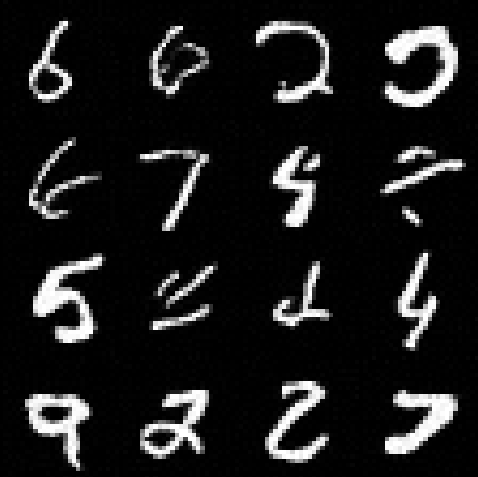
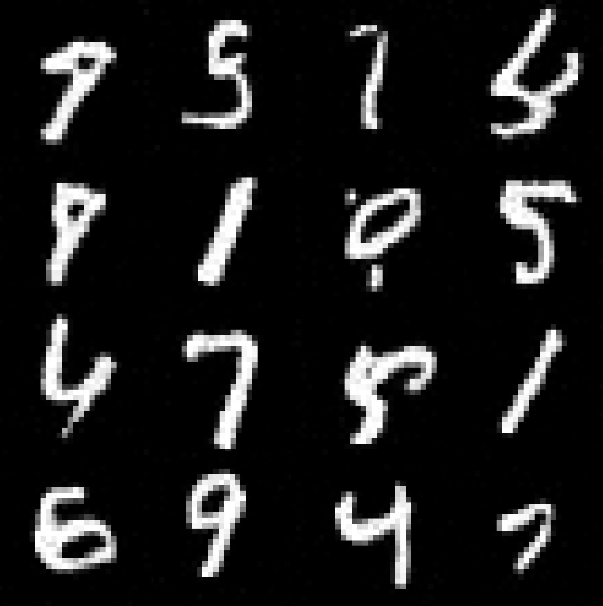
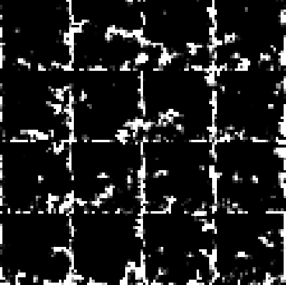

<div align="center">

# One Bit is All You Need to Diffuse

### Native Binarization for 1-Bit Diffusion Models

*Nihal Gazi · Ayushman Bhattacharya · Aditya K. Biswas · Saubhagya Kunti · Aihik Basu*

Institute of Engineering and Management · JIS University, Kolkata, India

---

[](paper/paper.pdf)
[](LICENSE)

</div>

---

## What is this?

Diffusion models — the AI behind image generators — are powerful but **too heavy** to run on phones, embedded systems, or edge devices. The standard fix is to compress the model by rounding its numbers down to just 1 bit per value (called *binarization*). The problem? Every existing approach breaks the model when you do this, producing pure noise instead of images.

**This paper shows that the problem is not binarization itself — it's *how* you binarize.**

The standard method compresses an already-trained model after the fact ("Train, then Quantize"). We show this destroys the model's internal structure. Our method, **Native Binarization**, trains the binary model from scratch inside the 1-bit constraint from day one. The result: a fully 1-bit diffusion model that actually works.

---

## The Key Results

| Model | Method | FID ↓ | Legibility ↑ |
|---|---|---|---|
| Full Precision (FP16) | Baseline | — | — |
| **1-Bit Weights (W1A16)** | **Native (ours)** | **24.22** | **89.92%** |
| 1-Bit Weights (W1A16) | Standard PTQ | 381.79 | 0.00% |

> **FID** measures how realistic the generated images look (lower = better).
> **Legibility** measures whether generated digits are actually recognizable (higher = better).

The standard approach completely collapses — it generates random noise (FID 381.79, 0% legibility). Our native approach matches full-precision quality at **32× less memory** and **58× less compute**.

---

## How It Works

We identify two reasons why native binary training succeeds where post-training quantization fails:

**1. Structural Dominance**
Before binarizing a weight, we subtract its mean. This forces the binary approximation to capture the *direction* of the weight — the part that actually encodes the model's learned structure — rather than being wasted on a DC offset.

**2. Topological Stability**
We apply batch normalization *before* the binary activation function (not after). This keeps the activation inputs centered around zero throughout training, preventing dead neurons and gradient starvation — the two main failure modes in binary networks.

---

## Sample Outputs

<table>
<tr>
  <td align="center"><b>FP16 Baseline</b></td>
  <td align="center"><b>W1A16 Native (ours)</b></td>
  <td align="center"><b>W1A16 PTQ (collapsed)</b></td>
</tr>
<tr>
  <td></td>
  <td></td>
  <td></td>
</tr>
</table>

---

## Repository Structure

```
Native-Binarization/
│
├── paper/                  ← Research paper
│   ├── paper.tex           ← LaTeX source (IEEEtran)
│   ├── paper.pdf           ← Compiled PDF (7 pages)
│   ├── paper.md            ← Markdown draft
│   └── references.bib      ← BibTeX bibliography (20 entries)
│
├── assets/                 ← Generated sample images for all model variants
│   ├── fp16_*.png          ← Full-precision baseline outputs
│   ├── w1a16_*.png         ← W1A16 native + PTQ outputs
│   └── w1a1_*.png          ← W1A1 native + PTQ outputs
│
├── code/                   ← All training, quantization, and evaluation scripts
│   ├── Trainers/           ← Training scripts (FP16, W1A16, W1A1)
│   ├── Quantizers/         ← Post-training quantization converters
│   ├── Benchmarks/         ← FID and legibility evaluation scripts
│   └── model_output_generator.py  ← 3-way visual comparison tool
│
├── models/                 ← Model architecture definitions (Python package)
│   └── architectures.py    ← ResUNet_FP16, ResUNet_W1A16, ResUNet_W1A1, MNISTClassifier
│
├── pre_trained_models/     ← Saved model checkpoints (.pth files)
│   ├── BNN_W1A1/           ← w1a1.pth (native), fp16_to_w1a1.pth (PTQ)
│   └── FP16_and_W1A16/     ← fp16.pth, w1a16.pth (native), fp16_to_w1a16.pth (PTQ)
│
├── data/                   ← MNIST dataset (~63 MB, auto-downloaded by torchvision)
│
└── templates/              ← Paper formatting templates
    └── format.docx
```

---

## Getting Started

**Requirements:** Python 3.8+, PyTorch, torchvision, scipy, tqdm, matplotlib

```bash
# Install the model architecture package
pip install -e .
```

> **Note:** CUDA is strongly recommended — CPU inference across 1,000 timesteps is very slow.

**Run FID evaluation:**
```bash
python code/Benchmarks/FP16_and_W1A16/fid_check.py
python code/Benchmarks/BNN_W1A1/bnn_fid_check.py
```

**Run legibility evaluation:**
```bash
python code/Benchmarks/FP16_and_W1A16/legibility_check.py
python code/Benchmarks/BNN_W1A1/bnn_legiblitity_check.py
```

**Generate 3-way comparison image (FP16 / W1A16 / W1A1):**
```bash
python code/model_output_generator.py
```

**Pre-trained model naming conventions:**

| File | Description |
|---|---|
| `w1a1.pth` | W1A1 trained from scratch (Native Binarization) |
| `fp16_to_w1a1.pth` | FP16 model post-training quantized to W1A1 (PTQ baseline) |
| `w1a16.pth` | W1A16 trained from scratch (Native Binarization) |
| `fp16_to_w1a16.pth` | FP16 model post-training quantized to W1A16 (PTQ baseline) |
| `fp16.pth` | Full-precision FP16 baseline |

---

## Citation

If you use this work in your research, please cite:

```bibtex
@inproceedings{gazi2025nativebinarization,
  title     = {One Bit is All You Need to Diffuse},
  author    = {Nihal Gazi and Ayushman Bhattacharya and Aditya K. Biswas
               and Saubhagya Kunti and Aihik Basu},
  booktitle = {[Venue]},
  year      = {2025}
}
```

See [`CITATION.cff`](CITATION.cff) for more citation formats.

---

<div align="center">
<sub>Institute of Engineering and Management · JIS University · Kolkata, India</sub>
</div>
