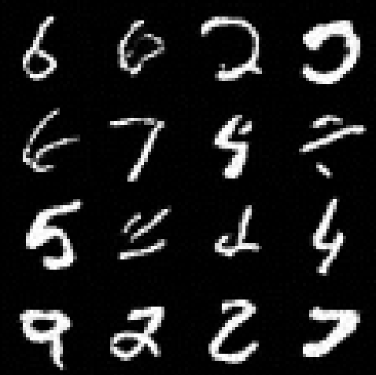
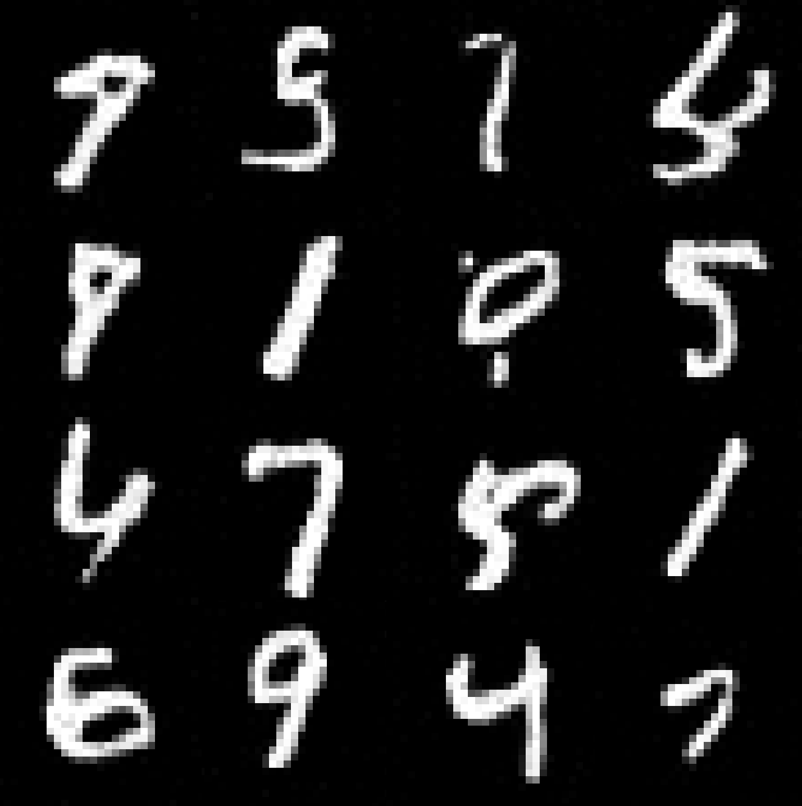
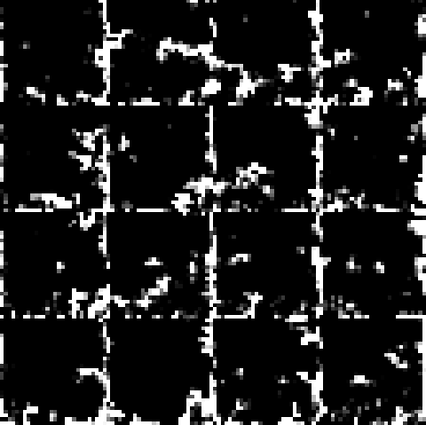
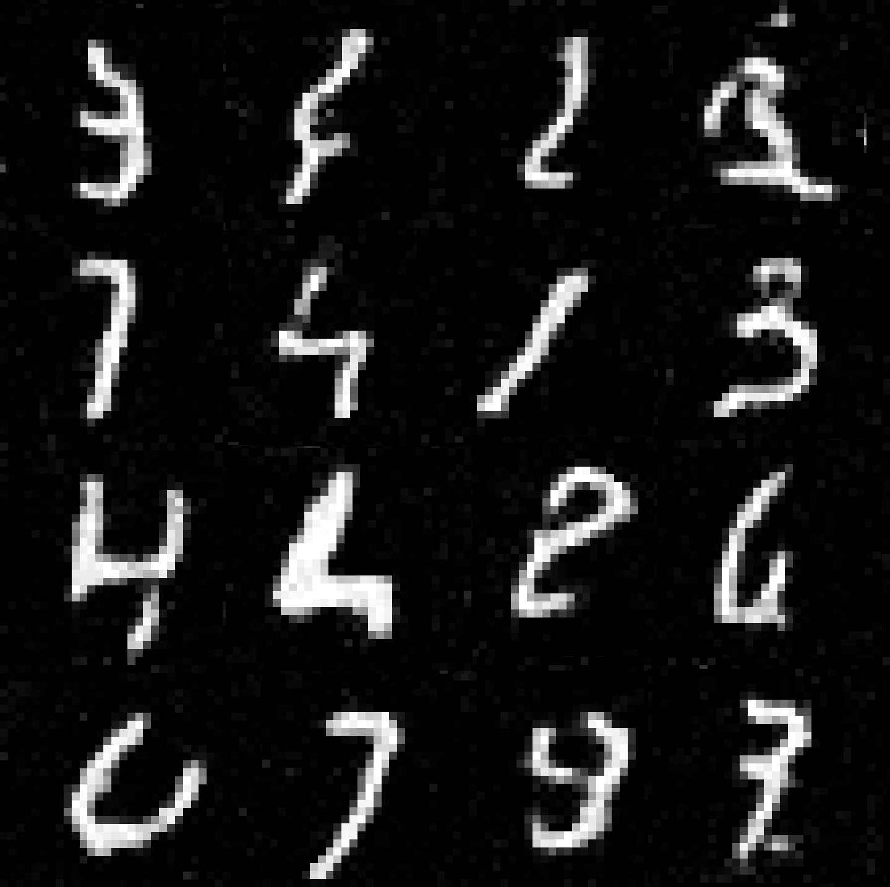
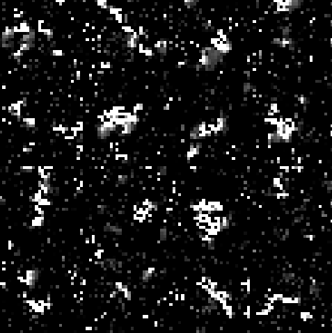

<div align="center">

# One Bit is All You Need to Diffuse

### Native Binarization for 1-Bit Diffusion Models

*Nihal Gazi · Ayushman Bhattacharya · Aditya K. Biswas · Saubhagya Kunti · Aihik Basu*

Institute of Engineering and Management · JIS University, Kolkata, India

---

[](paper/paper.pdf)
[](LICENSE)

</div>

---

## What is this?

Diffusion models — the AI behind image generators — are powerful but **too heavy** to run on phones, embedded systems, or edge devices. The standard fix is to compress the model by rounding its numbers down to just 1 bit per value (called *binarization*). The problem? Every existing approach breaks the model when you do this, producing pure noise instead of images.

**This paper shows that the problem is not binarization itself — it's *how* you binarize.**

The standard method compresses an already-trained model after the fact ("Train, then Quantize"). We show this destroys the model's internal structure. Our method, **Native Binarization**, trains the binary model from scratch inside the 1-bit constraint from day one. The result: a fully 1-bit diffusion model that actually works.

---

## The Key Results

### v1 — MNIST Digit Generation

| Model | Method | FID ↓ | Legibility ↑ |
|---|---|---|---|
| Full Precision (FP16) | Baseline | — | — |
| **1-Bit Weights (W1A16)** | **Native (ours)** | **24.22** | **89.92%** |
| 1-Bit Weights (W1A16) | Standard PTQ | 381.79 | 0.00% |

> The standard approach completely collapses — generating random noise (FID 381.79, 0% legibility). Our native approach achieves high digit legibility at **32× less memory** and **58× less compute**.

### v2 — CelebA Face Generation (Grayscale, 32×32)

All models trained for **100 epochs** on 10,000 aligned grayscale CelebA faces.

| Model Variant | Model Size | FID ↓ | Legibility ↑ | Utility Score ↑ |
|---|---|---|---|---|
| FP16 Baseline | 3879.0 KB | 104.17 | 99.98% | 0.00951 |
| **W1A16 Native (ours)** | **242.4 KB** | **131.07** | **99.98%** | **0.12113** |
| W1A1 Native (ours) | 242.4 KB | 213.77 | 99.98% | 0.07448 |
| W1A16 PTQ | 242.4 KB | 284.62 | 99.98% | 0.05601 |
| W1A1 PTQ | 242.4 KB | 315.61 | 99.94% | 0.05051 |

> **FID** measures distributional realism (lower = better). **Legibility** is the probability a lightweight face classifier detects a coherent face in the output. **Utility Score** = `(Legibility × Compression Factor) / (1 + FID)` — a composite metric that penalizes both quality collapse and poor compression simultaneously.
>
> Native W1A16 achieves **16× compression** with only a 27-point FID penalty vs. the full-precision baseline, while PTQ at the same compression ratio degrades FID by 180 points.

---

## How It Works

We identify two reasons why native binary training succeeds where post-training quantization fails:

**1. Structural Dominance**
Before binarizing a weight, we subtract its mean. This forces the binary approximation to capture the *direction* of the weight — the part that actually encodes the model's learned structure — rather than being wasted on a DC offset.

**2. Topological Stability**
We apply batch normalization *before* the binary activation function (not after). This keeps the activation inputs centered around zero throughout training, preventing dead neurons and gradient starvation — the two main failure modes in binary networks.

---

## Sample Outputs

### v1 — MNIST: Three-Way Comparison (FP16 / W1A16 / W1A1)
<table>
<tr>
  <td align="center"><b>FP16 Baseline</b></td>
  <td align="center"><b>W1A16 Native (ours)</b></td>
  <td align="center"><b>W1A16 PTQ (collapsed)</b></td>
</tr>
<tr>
  <td></td>
  <td></td>
  <td></td>
</tr>
</table>

### v1 — MNIST: W1A1 Comparison
<table>
<tr>
  <td align="center"><b>FP16 Baseline</b></td>
  <td align="center"><b>W1A1 Native (ours)</b></td>
  <td align="center"><b>W1A1 PTQ (collapsed)</b></td>
</tr>
<tr>
  <td></td>
  <td></td>
  <td></td>
</tr>
</table>

### v2 — CelebA: Native vs PTQ Comparison
See [`v2-celeba/outputs/`](v2-celeba/outputs/) for all generated grids, or [`v2-celeba/RESULTS.md`](v2-celeba/RESULTS.md) for the full benchmark report.

---

## Repository Structure

```
Native-Binarization/
│
├── paper/                  ← Research paper
│   ├── paper.tex           ← LaTeX source (IEEEtran)
│   ├── paper.pdf           ← Compiled PDF
│   ├── paper.md            ← Markdown draft
│   └── references.bib      ← BibTeX bibliography
│
├── v1-mnist/               ← MNIST experiment (v1 ablation study)
│   ├── assets/             ← Generated sample images (all model variants)
│   ├── code/
│   │   ├── Trainers/       ← FP16, W1A16, W1A1 training scripts
│   │   ├── Quantizers/     ← Post-training quantization converters
│   │   ├── Benchmarks/     ← FID and legibility evaluation
│   │   └── model_output_generator.py
│   ├── models/             ← ResUNet architectures + MNISTClassifier
│   └── pre_trained_models/ ← .pth checkpoints for all variants
│
├── v2-celeba/              ← CelebA experiment (v2, 100-epoch optimized runs)
│   ├── code/
│   │   ├── models/         ← BitConv2d_Std, ResBlock1Bit, ResUNet_FP16/W1A16/W1A1
│   │   ├── trainers/       ← AMP trainer (base.py) + PTQ converter (ptq.py)
│   │   ├── benchmarks/     ← FID scorer + face legibility judge
│   │   ├── samplers/       ← DDPM 1000-step sampler + linear schedule
│   │   ├── train_fp16_opt.py    ← Optimized FP16 training
│   │   ├── train_w1a16_opt.py   ← Optimized W1A16 native training
│   │   ├── train_w1a1_opt.py    ← Optimized W1A1 native training
│   │   └── run_benchmarks.py   ← Master 5-way benchmark runner
│   ├── checkpoints/        ← Per-epoch .pth snapshots + final models
│   ├── outputs/            ← Sample grids + comparison images
│   └── RESULTS.md          ← Full quantitative benchmark report
│
├── v2-cifar10/             ← CIFAR-10 experiment (planned)
│
└── requirements.txt        ← Python dependencies
```

---

## Getting Started

**Requirements:** Python 3.8+, PyTorch ≥ 2.0, torchvision, scipy, Pillow, tqdm, matplotlib, opencv-python

```bash
pip install -e .
```

> **Note:** CUDA is strongly recommended — CPU inference across 1,000 DDPM timesteps is very slow.

### v1 — MNIST Benchmarks
```bash
python v1-mnist/code/Benchmarks/FP16_and_W1A16/fid_check.py
python v1-mnist/code/Benchmarks/FP16_and_W1A16/legibility_check.py
python v1-mnist/code/Benchmarks/BNN_W1A1/bnn_fid_check.py
python v1-mnist/code/Benchmarks/BNN_W1A1/bnn_legiblitity_check.py
```

### v2 — CelebA Training + Benchmarks
```bash
# Train all three native models (100 epochs each)
python -m v2-celeba.code.train_fp16_opt
python -m v2-celeba.code.train_w1a16_opt
python -m v2-celeba.code.train_w1a1_opt

# Run 5-way benchmark → writes RESULTS.md
python -m v2-celeba.code.run_benchmarks
```

See [`v2-celeba/README.md`](v2-celeba/README.md) for the full execution guide.

---

## Citation

If you use this work in your research, please cite:

```bibtex
@inproceedings{gazi2025nativebinarization,
  title     = {One Bit is All You Need to Diffuse},
  author    = {Nihal Gazi and Ayushman Bhattacharya and Aditya K. Biswas
               and Saubhagya Kunti and Aihik Basu},
  booktitle = {[Venue]},
  year      = {2025}
}
```

See [`CITATION.cff`](CITATION.cff) for more citation formats.

---

<div align="center">
<sub>Institute of Engineering and Management · JIS University · Kolkata, India</sub>
</div>
