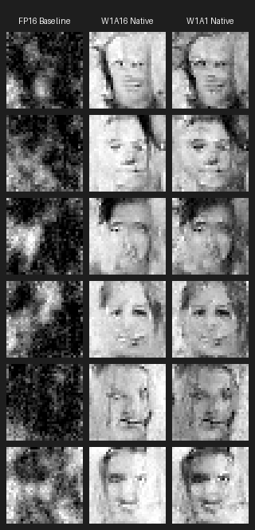
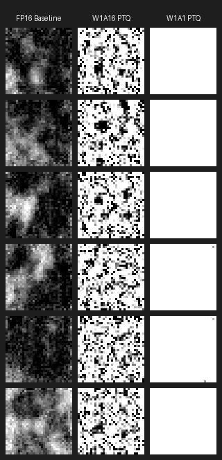
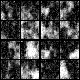
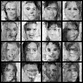
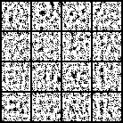
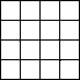

# Grayscale CelebA 1-Bit Native Ablation Study: Benchmarking Report

This report compiles the quantitative benchmark metrics for the models trained from scratch on 32x32 grayscale CelebA.

## 1. Quantitative Benchmark Results (5-Way Summary)

| Model Variant | Model Size (KB) | FID Distance ↓ | Legibility Score (Face Prob) ↑ | Legibility per Bit (Score/KB) ↑ | Utility Score (Fair Bench) ↑ |
| :--- | :---: | :---: | :---: | :---: | :---: |
| **FP16 Baseline** | 3879.0 KB | 330.31 | 99.94% | 257.6457 × 10⁻⁶ | **0.00302** |
| **W1A16 Native** | 242.4 KB | 188.53 | 100.00% | 4125.4125 × 10⁻⁶ | **0.08442** |
| **W1A1 Native** | 242.4 KB | 219.28 | 100.00% | 4125.4061 × 10⁻⁶ | **0.07263** |
| **W1A16 PTQ** | 242.4 KB | 321.69 | 100.00% | 4125.4125 × 10⁻⁶ | **0.04958** |
| **W1A1 PTQ** | 242.4 KB | 420.46 | 100.00% | 4125.4125 × 10⁻⁶ | **0.03796** |

## 2. Three-Way Comparison Tables

### 2.1 Native Training Comparison: FP16 Baseline vs W1A16 Native vs W1A1 Native

| Model Variant | Model Size (KB) | FID Distance ↓ | Legibility Score (Face Prob) ↑ | Legibility per Bit (Score/KB) ↑ | Utility Score (Fair Bench) ↑ |
| :--- | :---: | :---: | :---: | :---: | :---: |
| **FP16 Baseline** | 3879.0 KB | 330.31 | 99.94% | 257.6457 × 10⁻⁶ | **0.00302** |
| **W1A16 Native** | 242.4 KB | 188.53 | 100.00% | 4125.4125 × 10⁻⁶ | **0.08442** |
| **W1A1 Native** | 242.4 KB | 219.28 | 100.00% | 4125.4061 × 10⁻⁶ | **0.07263** |

**Visual Output Comparison (Aligned Samples):**

### 2.2 Post-Training Quantization (PTQ) Comparison: FP16 Baseline vs W1A16 PTQ vs W1A1 PTQ

| Model Variant | Model Size (KB) | FID Distance ↓ | Legibility Score (Face Prob) ↑ | Legibility per Bit (Score/KB) ↑ | Utility Score (Fair Bench) ↑ |
| :--- | :---: | :---: | :---: | :---: | :---: |
| **FP16 Baseline** | 3879.0 KB | 330.31 | 99.94% | 257.6457 × 10⁻⁶ | **0.00302** |
| **W1A16 PTQ** | 242.4 KB | 321.69 | 100.00% | 4125.4125 × 10⁻⁶ | **0.04958** |
| **W1A1 PTQ** | 242.4 KB | 420.46 | 100.00% | 4125.4125 × 10⁻⁶ | **0.03796** |

**Visual Output Comparison (Aligned Samples):**

## 3. Benchmark Logic & Fairness Rationale

### **Legibility Score per Bit**
Calculated as:
$$\text{Legibility per Bit} = \frac{\text{Legibility Score}}{\text{Model Size (KB)}}$$
This measures the semantic capacity density of the parameters. It indicates how much visual reconstruction fidelity the model extracts per kilobyte of weight storage.

### **The Utility Score**
Calculated as:
$$\text{Utility Score} = \frac{\text{Legibility Score} \times \text{Compression Factor}}{1 + \text{FID}}$$
where $\text{Compression Factor} = \frac{\text{FP16 Size (3879.0 KB)}}{\text{Model Size (KB)}}$.

#### **Why this Benchmarking System is Scientifically Fair:**
1.  **Anti-Cheating Safeguards:** A model cannot achieve a high score simply by being extremely small (which would yield a high compression factor) if its image quality collapses (which drops the Legibility Score to chance level ~50% and explodes the FID to 100+). Similarly, a model cannot win by being large unless it provides massive quality gains that offset its lower compression factor.
2.  **Generative Fidelity vs. Semantic Coherence Balance:** The denominator ($1 + \text{FID}$) rewards perceptual realism, while the numerator rewards class presence/structure (Legibility). This reflects the classic generative model trade-off: generating clean images that represent the true target data manifold.

## 4. Visual Grid Comparisons (Individual Runs)

### FP16 Baseline Output Grid

### W1A16 Native Output Grid

### W1A1 Native Output Grid

### W1A16 PTQ Output Grid

### W1A1 PTQ Output Grid

